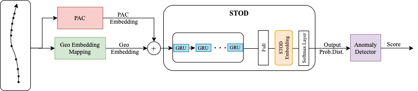

# ITS Research — Anomaly Detection on Bus Trajectories

Research on intelligent transportation systems (ITS) focused on two problems: **activity labeling** at each GPS point of a bus trajectory, and **anomaly detection** to identify irregular routes. Three progressively refined approaches are implemented, from a stacked RNN baseline to a Transformer-based model.

## Research problems

### 1. Point Activity Classification (PAC)

Each GPS point in a bus trajectory is labeled as one of four activity types:

| Label | Meaning |
|---|---|
| In route | Bus moving normally along its route |
| Bus stop | Scheduled passenger stop |
| Traffic signal | Stopped at a traffic light |
| Other stop | Unplanned stop (breakdown, incident, etc.) |

A stacked deep learning model composed of recurrent and attention layers learns a vector representation per trajectory point from temporal and spatial features.

### 2. Spatial-Temporal Outlier Detection (STOD)

Instead of a hard anomaly/normal binary decision, STOD trains a multi-class trajectory classifier and derives an **anomaly score from the prediction uncertainty**. Trajectories the model is unsure about are flagged as potential anomalies. This soft-scoring approach is more robust than threshold-based detectors.

### 3. Transformer for Anomaly Detection

A Transformer language model applied to sequences of GPS trajectory points. The model treats trajectory segments as "tokens" and learns typical bus behavior patterns. Deviations from learned patterns are scored as anomalies.

## Repository structure

```
its_research/
├── point_activity_classification/    # PAC model — RNN + attention
│   ├── building_trajectories/        # GPS point sequence construction
│   ├── labeling/                     # Activity label assignment
│   ├── cleaning/                     # Trajectory data cleaning
│   └── outlier_dectection/           # STOD anomaly scorer
├── transformer_model.py              # Transformer architecture definition
├── run_loop_transformer.py           # Training loop for transformer model
├── pipeline_to_generate_data.py      # End-to-end data preparation pipeline
├── preprocess_dublin.py              # Dublin Bus dataset preprocessing
├── preprocess_recife.py              # Recife BRT dataset preprocessing
├── utility/                          # Shared helpers (metrics, visualization)
├── dublin/                           # Dublin-specific data processing
└── arch_stod.png                     # STOD architecture diagram
```

## Tech Stack

- **Deep learning:** TensorFlow 2 / Keras, scikit-learn
- **Trajectory encoding:** H3 geospatial indexing, gensim embeddings
- **Visualization:** Plotly, gmplot
- **Data formats:** HDF5 (model weights), CSV (trajectory records)
- **Language:** Python 3.7+

## Datasets

### Dublin Bus (public)
Preprocessed data ready for experiments:
- [Dublin dataset part 1](https://drive.google.com/file/d/1tkpxtFulyWQhcaRuCqsDVMBLWW8UN3LL/view?usp=sharing)
- [Dublin dataset part 2](https://drive.google.com/file/d/1FmjM2Xi-mbwZALOTQcHBEgmg7uc71zwq/view?usp=sharing)
- [Preprocessed data for Transformer experiments](https://drive.google.com/file/d/12cDmUdY5lDEcLzBDaPtAGzs66MokqfuY/view?usp=sharing)

### Recife BRT (private)
The Recife dataset contains real-world GPS records from a Brazilian BRT system and is not publicly available. Preprocessing code (`preprocess_recife.py`) is included for reference.

## Setup

```bash
pip install numpy==1.18.1 h5py tensorflow==2.1.0 h3==3.4.3 gmplot \
            scikit-learn scipy gensim keras plotly
```

Place the downloaded Dublin data files in a `data/` directory at the repo root (excluded from git).

## Running the experiments

### Point Activity Classification

```bash
# 1. Build trajectories from raw GPS records
python point_activity_classification/building_trajectories/build.py

# 2. Assign activity labels
python point_activity_classification/labeling/label.py

# 3. Train the model
python point_activity_classification/train.py
```

### Transformer anomaly detection

```bash
# Prepare data
python pipeline_to_generate_data.py

# Train
python run_loop_transformer.py
```

## Model weights

Trained model weights (`.hdf5`) are excluded from this repository due to file size. The Dublin-trained PAC model is available on request via GitHub Issues.

## Architecture



The STOD model pipeline: raw GPS → feature engineering → multi-class classifier → uncertainty scoring → anomaly flag.
